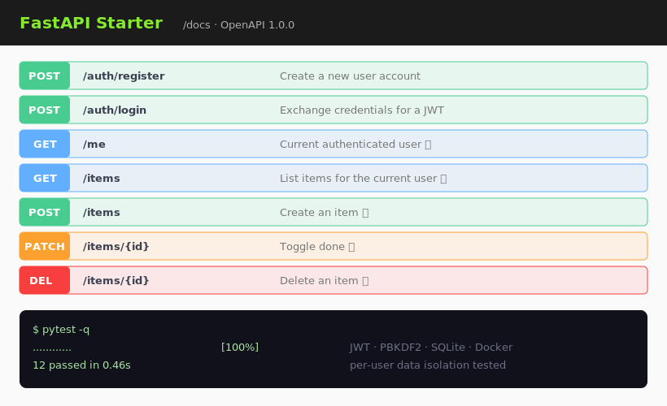

# fastapi-starter

[](https://github.com/JCreatesGH/fastapi-starter/actions)
[](https://www.python.org/)
[](LICENSE)

A production-shaped **FastAPI** starter you can clone and build on: JWT auth, password hashing, SQLite with a migration runner, per-user CRUD, auto-generated OpenAPI docs, Docker, and a real test suite. Runtime deps are minimal and the security primitives are pure-stdlib (easy to swap for `passlib`/`python-jose`).



## Features

- 🔐 **Auth** — register / login returning a signed **HS256 JWT**; passwords hashed with **PBKDF2-SHA256**.
- 🗄️ **SQLite** access layer with an idempotent migration runner and foreign keys on.
- 👤 **Per-user data isolation** — every `/items` query is scoped to the token's user (and that's tested).
- 📚 **Swagger UI** at `/docs`, ReDoc at `/redoc`, schema at `/openapi.json` — free from FastAPI.
- 🐳 **Docker + compose** with a persistent volume.
- ✅ **12 tests** across API behavior and security primitives.

## Run it

```bash
pip install -r requirements.txt
uvicorn app.main:app --reload      # http://localhost:8000/docs
# or:
docker compose up --build
```

## Try the flow

```bash
curl -X POST localhost:8000/auth/register -H 'Content-Type: application/json' \
     -d '{"email":"me@example.com","password":"password123"}'

TOKEN=$(curl -s -X POST localhost:8000/auth/login \
        -d 'username=me@example.com&password=password123' | jq -r .access_token)

curl localhost:8000/items -H "Authorization: Bearer $TOKEN"
```

## Project layout

```
app/
  main.py       # routes + schemas (factory: create_app)
  security.py   # PBKDF2 hashing + JWT encode/decode (stdlib)
  db.py         # SQLite connect/migrate/cursor helpers
  config.py     # env-driven settings
tests/          # TestClient API tests + security unit tests
Dockerfile · docker-compose.yml
```

## Development

```bash
python -m pytest -q
```

## License

MIT
